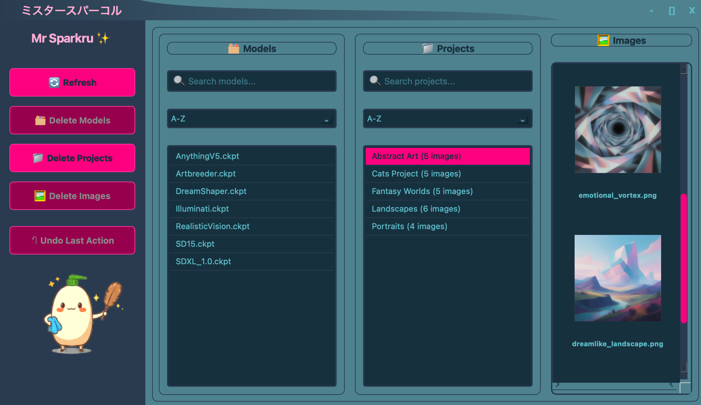

# ミスタースパーコル (Mr Sparkru) - A QoL tool for the Draw Things app


## What is Mr Sparkru?!

Mr Sparkru is a helper tool that assists with management of models and generated content in the Draw Things app. Primarily this assists with efficiently scrubbing your Draw Things installation clean of any unwanted models and/or generated AI slop. Please note that Mr Sparkru is quite effective so only delete models/content you no longer need!

## Features

*   **Model, Project, and Image Management**: Interactively delete models, projects, and images to free up disk space.
*   **Interactive Deletion Modes**: A command-line interface for quick deletions and a graphical UI for more detailed management.
*   **Undo Functionality**: A simple undo system to revert the last deletion action.
*   **Cross-Platform Support**: Primarily developed for macOS, but designed to be cross-platform compatible.

## Supported platforms

We will make our best effort for Mr Sparkru to be cross platform via python under the covers however Mr Sparkru is primarily developed for MacOS
## Supported platforms

While Mr Sparkru is primarily developed and tested on macOS, efforts have been made to ensure cross-platform compatibility using Python. It is expected to function on other Unix-like systems (Linux) and potentially Windows, though specific testing on these platforms may be limited.

## Installation
## Dependencies

This project utilizes `uv` for package management and virtual environment operations. Ensure you have `uv` installed. For detailed installation instructions, please refer to the official `uv` documentation.

No other system-level dependencies are strictly required for basic operation, but specific features might rely on underlying OS capabilities.

1.  **Clone the repository:**
    ```bash
    git clone https://github.com/64MM4-KN1F3/mr_sparkru.git
    cd mr_sparkru
    ```
2.  **Create a virtual environment and install dependencies:**
    This project uses `uv` for package management. Install it using instructions [here](https://docs.astral.sh/uv/).
    ```bash
    uv init
    uv venv
    source .venv/bin/activate
    uv sync
    ```

## Usage

### UI Application (`mr_sparkru.py`)



The UI application provides a graphical interface for managing your files.

**Run the application:**
```bash
uv run mr_sparkru.py
```

**Features:**
*   **Main Window**: A custom title bar with minimize, maximize, and close buttons.
*   **Sidebar**: Buttons for refreshing lists, deleting models, projects, and images, and undoing the last action.
*   **Models List**: Displays a list of all available models, with options for searching and sorting.
*   **Projects List**: Displays a list of all projects and the number of images in each, with options for searching and sorting.
*   **Thumbnails Display**: When a project is selected, it displays thumbnails of all images in that project.

### Command-Line Tool (`mr_sparkru_cli.py`)

The command-line tool allows you to delete models, projects, and images directly from the command line.

**Activate the virtual environment:**
```bash
source .venv/bin/activate
```

**To delete models:**
```bash
uv run python mr_sparkru_cli.py --delete-models model1.ckpt model2.ckpt
```

**To delete projects:**
```bash
uv run python mr_sparkru_cli.py --delete-projects "My First Project" "Another Project"
```

**To delete projects interactively:**
```bash
uv run python mr_sparkru_cli.py --delete-projects-interactive
```

**To delete images:**
```bash
uv run python mr_sparkru_cli.py --delete-images "My First Project" 1 2 3
```

**To delete images interactively:**
```bash
uv run python mr_sparkru_cli.py --delete-images-interactive
```

**To undo the last deletion:**
```bash
uv run python mr_sparkru_cli.py --undo
```
## Troubleshooting & FAQ

If you encounter any issues or have questions, please refer to the following:

*   **Reporting Issues:** Please open an issue on the GitHub repository with a detailed description of the problem, including steps to reproduce it and your environment details.
*   **Common Questions:**
    *   *Q: How do I ensure `uv` is installed correctly?*
        A: Refer to the official `uv` documentation for installation and verification steps.
    *   *Q: What if I accidentally delete something important?*
        A: Mr Sparkru includes an undo functionality. Please refer to the "Usage" section for commands like `--undo`.


**To clear the undo cache:**
```bash
uv run python mr_sparkru_cli.py --clear-undo-cache
```

## Contributing

Contributions are welcome! While this tool is released as-is, we encourage community contributions for ongoing support and development.

## License

This project is licensed under the MIT License.